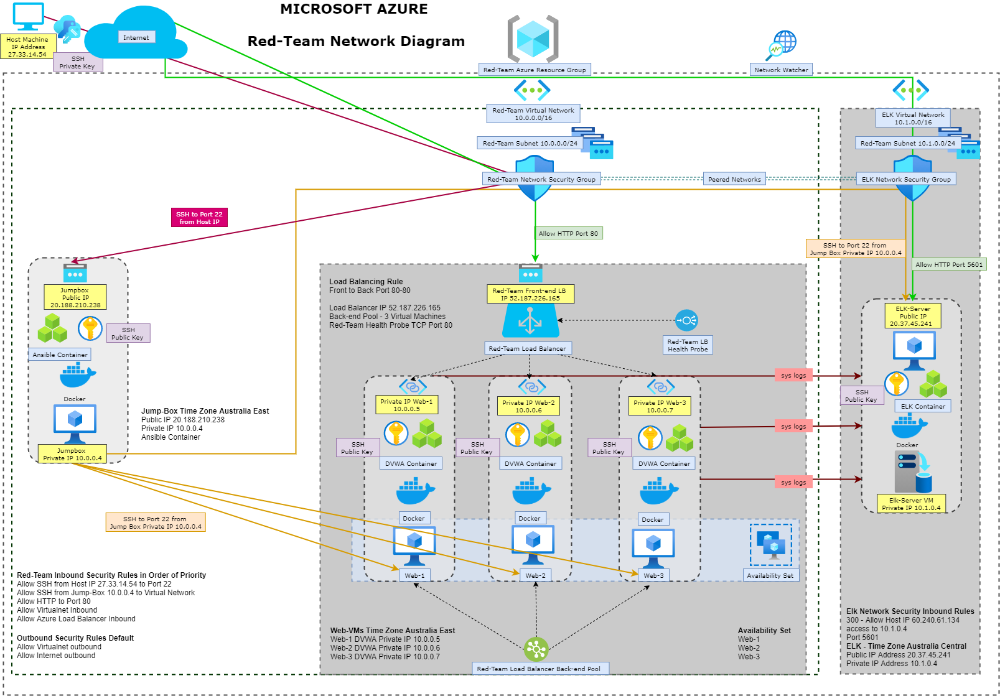
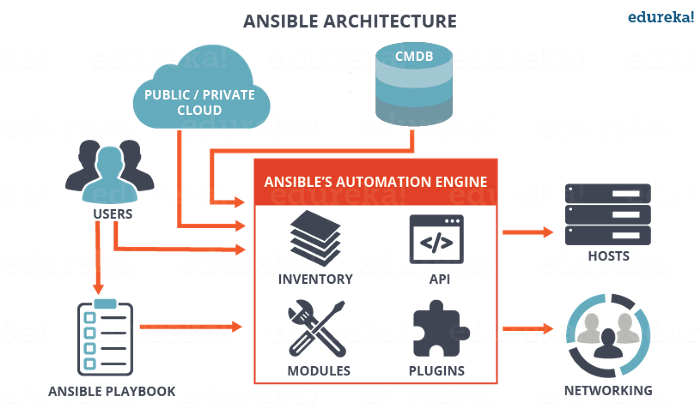
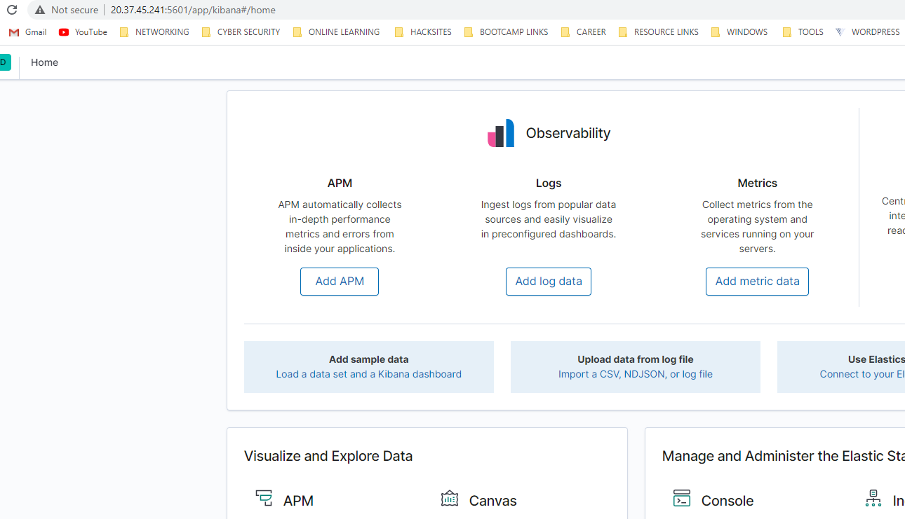

# Automated ELK Stack Deployment

This document contains the following details:
- Description of the Red-Team Network Topology
- Access Policies
- ELK Configuration
 - Beats in Use
 - Machines Being Monitored
- How to Use the Ansible Build


### Description of the Topology
This repository includes code defining the infrastructure below. 



The main purpose of this network is to expose a load-balanced and monitored instance of DVWA, the "D*mn Vulnerable Web Application"

An Azure load balancer is a Layer-4 (TCP, UDP) load balancer that provides high availability by distributing incoming traffic among healthy VMs. A load balancer health probe monitors a given port on each VM and only distributes traffic to an operational VM. In addition the Load Balancer restricts inbound access to the network. 

Access controls ensure that only authorised users will be able connect via secure connection from the Host Machine IP to the Jump Box (Gateway VM).

Integrating an ELK server allows users to easily monitor the vulnerable virtual machines (DVWA 1,2 & 3) for changes to the file systems of the VMs on the network, as well as watch system metrics, such as CPU usage; attempted SSH logins and sudo escalation failures.

The configuration details of each machine may be found below.

| Name          |   Function   | IP Address | Public IPv4   | Operating System    |
|---------------|--------------|------------|---------------|---------------------|
| Jump Box      | Gateway      | 10.0.0.4   | 20.188.210.238| Linux               |
| Load Balancer | Distribution | 10.0.0.4   | 52.187.226.165| Azure Load Balancer |
| DVWA 1        | Web Server   | 10.0.0.5   |               | Linux               |
| DVWA 2        | Web Server   | 10.0.0.6   |               | Linux               |
| DVWA 3        | Web Server   | 10.0.0.7   |               | Linux               | 
| ELK           | Monitoring   | 10.1.0.4   | 20.37.45.241  | Linux               |

### Access Policies
The machines on the internal network are not exposed to the public Internet. 

Only the Jump Box machine can accept connections from the Internet. Access to this machine is only allowed from the designated local host IP address 27.33.14.54 

Machines within the network can only be accessed by each other. The Jumpbox provisioner connects via SSH to the DVWA VMs and the ELK server. The DVWA Web Server machines send system logs to the ELK server to be forwarded for indexing.

A summary of the access policies in place can be found in the table below.

| Name          | Publicly Accessible | Allowed IP Addresses |
|---------------|---------------------|----------------------|
| Jump Box      | Yes                 | 27.33.14.54          |
| Load Balancer | Yes                 | 27.33.14.54          |
| ELK           | No                  | 10.0.0.1-254         |
| DVWA 1        | No                  | 10.0.0.1-254         |
| DVWA 2        | No                  | 10.0.0.1-254         |
| DVWA 3        | No                  | 10.0.0.1-254         |

## ELK Server Configuration
The ELK VM exposes an Elastic Stack instance. Docker is used to download and manage an ELK container.

Ansible was used to automate the configuration of the ELK machine. No configuration was performed manually, which is advantageous because the configuration of our Server can be easliy be automated and run on every machine within your network. To set up the ELK Server we developed a reusable Ansible Playbook providing the steps to automate the configuration proccess. Ansible Playbooks are the files where Ansible code is written, Playbooks tell Ansible what to exectute sequentially and are written in YAML (yet another markup lanuage) format. Ansible is a helpful tool that allows for configuraton management, Ansible issues all commands from a central location to perform these tasks. 

The below diagram depicts the Ansible architecture:
*source edureka!*




The playbook implements the following tasks:

 - Install docker
 - Install apt module
 - Install pip3
 - Install pip module
 - Download and launch a docker container

The following displays the result of running docker ps after successfully configuring the ELK instance. (Images/DockerPs.png)

```bash
$ sudo docker ps
CONTAINER ID        IMAGE               COMMAND                  CREATED             STATUS                  PORTS                                                                              NAMES
217ed9a25488        sebp/elk:761        "/usr/local/bin/star…"   6 days ago          Up Less than a second   0.0.0.0:5044->5044/tcp, 0.0.0.0:5601->5601/tcp, 0.0.0.0:9200->9200/tcp, 9300/tcp   elk
```

The playbook is duplicated below.

```yaml
---
# install_elk.yml
- name: Configure Elk VM with Docker
  hosts: elkservers
  remote_user: elk
  become: true
  tasks:
    # Use apt module
    - name: Install docker.io
      apt:
        update_cache: yes
        name: docker.io
        state: present

      # Use apt module
    - name: Install pip3
      apt:
        force_apt_get: yes
        name: python3-pip
        state: present

      # Use pip module
    - name: Install Docker python module
      pip:
        name: docker
        state: present

      # Use command module
    - name: Increase virtual memory
      command: sysctl -w vm.max_map_count=262144

      # Use sysctl module
    - name: Use more memory
      sysctl:
        name: vm.max_map_count
        value: "262144"
        state: present
        reload: yes

      # Use docker_container module
    - name: download and launch a docker elk container
      docker_container:
        name: elk
        image: sebp/elk:761
        state: started
        restart_policy: always
        published_ports:
          - 5601:5601
          - 9200:9200
          - 5044:5044
```

### Target Machines & Beats
This ELK server is configured to monitor the following machines:

-DVWA Web-1 at 10.0.0.5
-DVWA Web-2 at 10.0.0.6
-DVWA Web-3 at 10.0.0.7

We have installed the following Beats on these machines:
- Filebeat
- Metricbeat
- Packetbeat

These Beats allow us to collect the following information from each machine:
- **Filebeat**: Filebeat detects changes to the filesystem. Specifically, we use it to collect Apache logs.
- **Metricbeat**: Metricbeat detects changes in system metrics, such as CPU usage. We use it to detect SSH login attempts, failed `sudo` escalations, and CPU/RAM statistics.
- **Packetbeat**: Packetbeat collects packets that pass through the NIC, similar to Wireshark. We use it to generate a trace of all activity that takes place on the network, in case later forensic analysis should be warranted.

The playbook below installs Filebeat on the target hosts.

```yaml
---
- name: Installing and Launch Filebeat
  hosts: webservers
  become: yes
  tasks:
    # Use command module
  - name: Download filebeat .deb file
    command: curl -L -O https://artifacts.elastic.co/downloads/beats/filebeat/filebeat-7.4.0-amd64.deb

    # Use command module
  - name: Install filebeat .deb
    command: dpkg -i filebeat-7.4.0-amd64.deb

    # Use copy module
  - name: Drop in filebeat.yml
    copy:
      src: /etc/ansible/files/filebeat-configuration.yml
      dest: /etc/filebeat/filebeat.yml

    # Use command module
  - name: Enable and Configure System Module
    command: filebeat modules enable system

    # Use command module
  - name: Setup filebeat
    command: filebeat setup

    # Use command module
  - name: Start filebeat service
    command: service filebeat start
    ```

The playbook below installs Metricbeat on the target hosts. 

```yaml
---
- name: Install metric beat
  hosts: webservers
  become: true
  tasks:
    # Use command module
  - name: Download metricbeat
    command: curl -L -O https://artifacts.elastic.co/downloads/beats/metricbeat/metricbeat-7.4.0-amd64.deb

    # Use command module
  - name: install metricbeat
    command: dpkg -i metricbeat-7.4.0-amd64.deb

    # Use copy module
  - name: drop in metricbeat config
    copy:
      src: /etc/ansible/files/metricbeat-config.yml
      dest: /etc/metricbeat/metricbeat.yml

    # Use command module
  - name: enable and configure docker module for metric beat
    command: metricbeat modules enable docker

    # Use command module
  - name: setup metric beat
    command: metricbeat setup

    # Use command module
  - name: start metric beat
    command: service metricbeat start
```

### Using the Playbooks
In order to use the playbooks, you will need to have an Ansible control node already configured. 
SSH into the Jump Box for this purpose.

To use the playbooks, we must perform the following steps:
- Copy the playbooks to the Ansible Control Node 
- Run each playbook on the appropriate targets

Update `hosts` file to specify which VMs to run each playbook on. Run the commands below:

```bash
$ cd /etc/ansible
$ ls 
$ nano hosts

# List the IP Addresses of your webservers
# You should have at least 2 IP addresses
[webservers]
10.0.0.4 ansible_python_interpreter=/usr/bin/python3
10.0.0.5 ansible_python_interpreter=/usr/bin/python3
10.0.0.6 ansible_python_interpreter=/usr/bin/python3

# List the IP address of your ELK server
# There should only be one IP address
[elkservers]
10.1.0.4 ansible_python_interpreter=/usr/bin/python3

After this, the commands below run the playbook:

 ```bash
 $ cd /etc/ansible
 $ ansible-playbook install_elk.yml elk
 $ ansible-playbook install_filebeat.yml webservers
 $ ansible-playbook install_metricbeat.yml webservers
 ```

To verify success, wait five minutes to give ELK time to start up. 

Then, run: `curl http://10.1.0.4:5601`. This is the address of Kibana. If the installation succeeded, this command should print HTML to the console.

To confirm Kibana is running open Browser and enter`http://20.37.45.241:5601/app/kibana`


